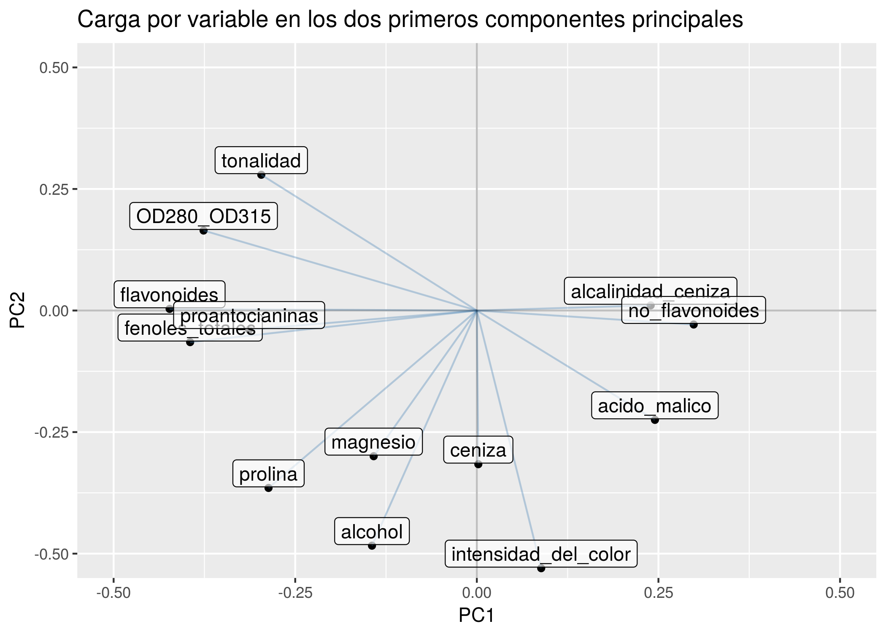
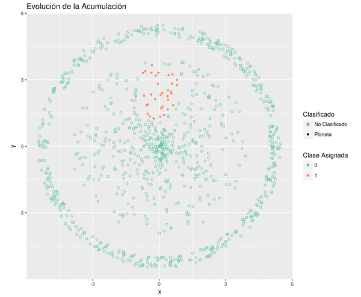

Cargamos librerías y código auxiliar:

```{r warning = F, message = F}
library(tidyverse)
library(glue)

set.seed(42)

source("R/leer_dataset.R")
source("R/pca.R")
source("R/k_medias.R")
source("R/helpers.R")
source("R/dbscan.R")
source("R/funcion_dibujar_planeta.R")
source("vignettes/acumulacion_espacial.R")
```

# 1.1 PCA y K-medias

Leemos y escalamos el dataset. La razón para centrar cada columna en cero es
que el PCA se computa más fácilmente de ese modo. La razón para estandarizar
cada columna (dividiendo por el desvío) es para compensar la diferencia
de unidades entre las variables del dataset. Sin la estandarización, las
variables con mayor valor absoluto de varianza cooptarían los primeros
componentes principales de un PCA, por un lado, y dominarían también el cálculo
de distancias euclídeas al centroide en el algoritmo K-medias.

```{r}
wine <- leer_dataset("data/wine.txt")
wine_escalado <- scale(wine) %>% as_tibble
```

Agrupamos los datos utilizando el algoritmo **K-medias**. Tras algunas pruebas
a mano, decidimos que el dataset puede dividirse en 3 grupos, pero de todos
modos computamos la clusterización para varios valores de k:

```{r cache = T}
resultados_k_means <-
  tibble(k = 2:6) %>%
  mutate(categorias = map(k, ~k_medias(df = wine_escalado, k = .x, verboso = F))) %>%
  mutate(categorias = map(categorias, ~.x$cluster_id))

categorias_por_k <- resultados_k_means$categorias
names(categorias_por_k) <- resultados_k_means$k
```

Queremos ver cuán bien fueron agrupados los datos con K-medias, pero
el dataset tiene 13 dimensiones, lo que dificulta su visualización.
Vamos a realizar entonces un **análisis de componentes principales (PCA)** para
obtener unos pocos ejes (componentes principales o PCs), sobre los cuales
proyectar los datos y poder así visualizar el agrupamiento.

```{r}
pca <- analisis_de_componentes_principales(wine_escalado)
```

Observemos el porcentaje de varianza explicado al considerar progresivamente más
componentes principales:

```{r}
porcentaje_varianza <- tibble(
  PC = names(pca$varianza_explicada),
  porcentaje_varianza_pc = pca$varianza_explicada * 100,
  porcentaje_varianza_acumulada = cumsum(porcentaje_varianza_pc)
)

scree_plot <- porcentaje_varianza %>%
  ggplot(aes(x = PC, y = porcentaje_varianza_acumulada)) +
  geom_point() +
  geom_label(aes(x = 1:13, y = porcentaje_varianza_acumulada-5,
                 label = paste0(round(porcentaje_varianza_pc, 2), "%")), size = 3) +
  labs(
    title = "4 PCs acumulan más del 70% de varianza del dataset",
    subtitle = "Debajo de cada punto, el % parcial de la varianza explicada.",
    y = "% Varianza Total Acumulada") +
  geom_hline(
    yintercept = 73.6, color = "SteelBlue", linetype = "dashed", size = 0.4) +
  geom_vline(
    xintercept = 4, color = "SteelBlue", linetype = "dashed", size = 0.4) +
  scale_x_discrete(limits = porcentaje_varianza$PC) +
  scale_y_continuous(breaks = seq(0, 100, by = 10), limits = c(0, 100))

ggsave("imgs/scree_plot.png", scree_plot)
```


Puede apreciarse que con 4 componentes principales resumimos más del 70% (~73.6%) de la
varianza total del dataset. Sin embargo, la estructura más interesante se
observa con los PC1 y PC2, de modo que nos limitaremos a graficar esos
componentes.

Por otro lado, graficamos las "cargas" (_loadings_) de los dos primeros
componentes principales para las 13 variables del dataset, de modo de
identificar si algunas variables particulares se llevan la mayor parte de la
varianza:

```{r}
vectores_de_carga <-
  pca$matriz_de_autovectores %>%
  as_tibble %>%
  mutate(predictor = names(wine)) %>%
  rename(PC1 = V1, PC2 = V2)

fig_loadings <- vectores_de_carga %>%
  ggplot(aes(PC1, PC2)) +
  geom_point() +
  ggtitle("Carga por variable en los dos primeros componentes principales") +
  geom_segment(mapping = aes(x = 0, y = 0, xend = PC1, yend = PC2),
               alpha = 0.35, color = "SteelBlue") +
  geom_label(mapping = aes(label = predictor, y = PC2 + 0.03), alpha = 0.65) +
  geom_hline(yintercept = 0, alpha = 0.25) +
  geom_vline(xintercept = 0, alpha = 0.25) +
  coord_cartesian(xlim = c(-0.5, 0.5), ylim = c(-0.5, 0.5))

ggsave(filename = "imgs/cargas_PC1_PC2.png", plot = fig_loadings)
```



El primer componente principal reúne principalmente la variación de fenoles
en el vino, ya sea fenoles flavonoides o no flavonoides, además de otras
características como la tonalidad y el contenido de prolina y de ácido málico.
Algunas correlaciones deberían ser analizadas por un experto del vino:
el contenido de proantocianinas parece altamente correlacionado con el de
fenoles flavonoides y la proporción OD<sub>280</sub>/OD<sub>315</sub>,
mientras que el de los fenoles no flavonoides con la alcalinidad de la ceniza.

El segundo componente principal, por otro lado, resume aproximadamente
otro conjunto de características: el contenido de magnesio, prolina, alcohol,
la intensidad del color y la tonalidad. Algunas de estas variables se reparten
entre PC1 y PC2, de modo que la interpretación química-vinícola de los PCs no es
tan transparente y debe realizarse con precaución.

Grafiquemos ahora el agrupamiento de K-medias proyectado sobre los primeros dos
primeros componentes principales.

```{r}
graficar_pca <- function(pc_x, pc_y, k) {
  pca_con_clusters <-
    pca$Z %>% 
    mutate(cluster_id = categorias_por_k[[glue("{k}")]])
  
  pcx_var <- ratio_a_porcentaje(pca$varianza_explicada[[pc_x]])
  pcy_var <- ratio_a_porcentaje(pca$varianza_explicada[[pc_y]])

  n <- nrow(pca_con_clusters)
  colorines <- c("RoyalBlue", "Black", "Tomato", "ForestGreen",
                 "Chocolate", "HotPink", "GoldenRod")

  title <- paste("Análisis de componentes principales ({pc_x} vs. {pc_y})",
                 "Agrupamiento con K-medias (k = {k})", sep="\n")

  fig <- pca_con_clusters %>%
    ggplot() +
    aes_string(x = pc_x, y = pc_y, color = "cluster_id") +
    geom_point() +
    geom_hline(yintercept = 0, alpha = 0.25) +
    geom_vline(xintercept = 0, alpha = 0.25) +
    ggtitle(glue(title)) +
    xlab(glue("{pc_x} ({pcx_var}% varianza)")) +
    ylab(glue("{pc_y} ({pcy_var}% varianza)")) +
    scale_color_manual(values = colorines)

  ggsave(fig, filename = glue("imgs/{pc_x}_{pc_y}_k{k}.png"),
         width = 18, height = 15, units = "cm")
  return (fig)
}

for (k in names(categorias_por_k)) {
  fig <- graficar_pca("PC1", "PC2", k)
}

# Comando para generar el GIF en Linux, con ImageMagick:
# $ convert -delay 200 -loop 0 imgs/PC1_PC2*png imgs/PC1_PC2.gif
```


El agrupamiento que juzgamos más interesante en la proyección al espacio de los
dos primeros componentes principales es el generado con $k = 3$, donde se
distinguen dos grupos bien diferenciados en los cuadrantes "sudoeste" y "sudeste"
y un gran grupo en el "hemisferio norte" del gráfico. Este dataset completo
conforma un continuo y, al no haber cortes bruscos en la distribución de datos
en este subespacio de dos dimensiones, la preferencia de $k = 3$ es
necesariamente arbitraria.

Vale aclarar, que aunque la repetición de colores "entre cuadro y cuadro" de la
anumación remite a una continuidad entre las clases que cada uno representa, el
algoritmo "k medias" _no garantiza ninguna relación entre las clases obtenidas
con distintos valores de k_, y no merece interpretación alguna.

(**Nota**: esta distribución de "tipos" en forma de U, cuyos extremos están bien
diferenciados, pero unidos en el centro por un continuo de variación sin
cortes bruscos, recuerda al concepto de _ring species_ en biología
evolutiva y las dificultades que conlleva a la hora de subclasificar.)


# Ejercicio 2 (DBSCAN)

## Generación del Planeta

  Para obtener los conjuntos pedidos, dado que es conveniente ir experimentando con diversas cantidades de puntos, fue definida una función que nos da el planeta y su anillo tomando como parámetro la cantidad de puntos que el cuerpo de este debe contener. Esta función es `R/funcion_dibujar_planeta.R`.


```{r armado del planeta, cache=T}
planeta_chico <- dibujar_planeta(200)
planeta_y_anillo <- dibujar_planeta(500)

planeta_y_anillo %>% ggplot() +
  aes(x=x,y=y) +
  geom_point() +
  ggtitle("Planeta sin Acumular") +
  coord_fixed()
```


## Clasificación de la Órbita y el Planeta

 Realizamos dos implementaciones del algoritmo que constan en la carpeta `R`. La primera se llama `R/dbscan.R` y corresponde a lo visto en clase. Además, hicimos un intento con un algoritmo que realizase el cálculo de las distancias la menor cantidad de veces posibles y minimizase los recorridos sobre la tabla, este (`R/acumulacion_espacial.R`) resultó ser apreciablemente más lento y complejo pero parece tolerar mejor las condiciones adversas. 
  Es de notar que el problema fue específicamente diseñado para que este algoritmo lo resuelva con facilidad y por lo tanto no pusimos realmente bajo demanda ninguna de las dos implementaciones (a pesar de eso, hacemos un intento al final con el planeta de pocos puntos). 
  Uno de los atributos más interesantes de este algoritmo es la posibilidad de determinar que los puntos problemáticos son "ruido", peron en el caso del planeta con 1000 puntos esto no es necesario y al final de la evaluación no hay puntos clasificados como ruido. 


```{r clasificación del planeta, cache=T}

planeta_clasificado <- planeta_y_anillo %>%
  mutate(clase = dbscan(planeta_y_anillo[c("x", "y")], min_pts = 4, epsilon = .8))

planeta_clasificado %>% ggplot( ) +
  aes(x=x,y=y) +
  geom_point( aes(color=as.factor(clase)) ) +
  scale_color_brewer(palette = "Set2", name="Clase") +
  ggtitle("Planeta ya Acumulado") +
  coord_fixed()

```

### Animación de las Etapas del Proceso

  Para ver mejor cómo funciona el algoritmo y aprovechando que este sigue una heurística de corte netamente gráfico, realizamos una animación de su progreso. 
  El método empleado fue guardar el estado del conjunto de datos en cada recursión del algoritmo y realizar un gráfico de cada uno de esos estados, cosa que consta en `R/armar_gif.R` para la obtención de las matrices y en `R/armar_gif.R` para la obtención de los gráficos. Después usamos el comando `convert` de la suite *imagemagick*.




### Efectos de las Condiciones Adversas Sobre el Resultado

  Es interesante ver que el algoritmo *converge* a una menor cantidad de clases en tanto el parámetro *radio de los entornos de evaluación* que llamamos `epsilon` se ajusta correctamente a la densidad típica de los puntos. Ante la situación de reducción de este valor los algoritmos mostraron una sensibilidad diferente. 
  Evidentemente, el planeta con cantidad reducida de puntos introduce antes los inconvenientes. 


```{r planetas pequeños, warnings=F, cache=F}

algo1_1 <- preparar_para_acumular( planeta_chico )
algo1_1 <- acumulacion(algo1_1,0.8,4)

algo1_2 <- preparar_para_acumular( planeta_chico )
algo1_2 <- acumulacion(algo1_2,0.4,4)

algo2_1 <- planeta_chico %>%
  mutate(clase = dbscan(planeta_chico[c("x", "y")], min_pts = 5, epsilon = 0.8)) %>%
  mutate(ruido = ifelse(clase==-1,T,F))

algo2_2 <- planeta_chico %>%
  mutate(clase = dbscan(planeta_chico[c("x", "y")], min_pts = 5, epsilon = 0.4)) %>%
  mutate(ruido = ifelse(clase==-1,T,F))

graficar_con_ruido(algo1_1,"Primer Algoritmo: Epsilon Suficiente (0.8)")
graficar_con_ruido(algo1_2,"Primer Algoritmo: Epsilon Reducido (0.4)")

graficar_con_ruido(algo2_1,"Segundo Algoritmo: Epsilon Suficiente (0.8)")
graficar_con_ruido(algo2_2,"Segundo Algoritmo: Epsilon Reducido (0.4)")
```


  Un efecto interesante observado es cómo en el *Algoritmo 2 con epsilon suficiente* el algoritmo logra no crear un exceso de clases que no serían ni anillo ni planeta recurriendo a clasficar varios  puntos como ruido, mostrando la utilidad de incluir este concepto en el procedimiento. La única clase que no se corresponde con el patrón con el que fue generado es la clase 3 y esta forma un pequeño cúmulo claramente diferenciado. El primer algoritmo logró asociar al cuerpo del planeta este cúmulo. 


  Vale la pena repetir la evaluación bajando el umbral de tolerancia y comprobar que efectivamente, en caso de no clasificar los puntos como ruido proliferan pequeñas clases que sabemos que no se condicen con el diseño que elegimos para construir el conjunto.  
  
```{r umbral reducido }
algo2_1 <- planeta_chico %>%
  mutate(clase = dbscan(planeta_chico[c("x", "y")], min_pts = 8, epsilon = 0.8)) %>%
  mutate(ruido = ifelse(clase==-1,T,F))

graficar_con_ruido(algo2_1,"Segundo Algoritmo: Epsilon Suficiente (0.8) y Umbral Reducido")
```
