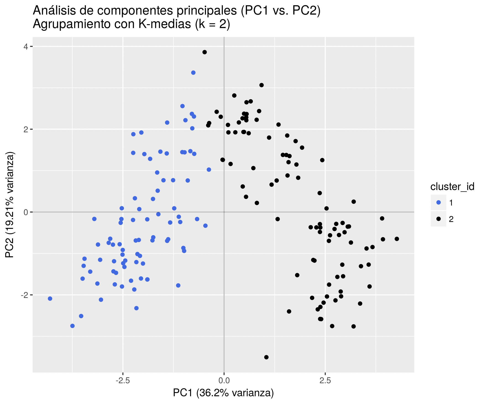

Cargamos librerías y código auxiliar:

```{r warning = F, message = F}
library(tidyverse)
library(glue)

set.seed(42)

source("R/leer_dataset.R")
source("R/pca.R")
source("R/k_medias.R")
source("R/helpers.R")
```

# 1.1 PCA y K-medias

Leemos y escalamos el dataset. La razón para centrar cada columna en cero es
que el PCA se computa más fácilmente de ese modo. La razón para estandarizar
cada columna (dividiendo por el desvío) es para compensar la diferencia
de unidades entre las variables del dataset. Sin la estandarización, las
variables con mayor valor absoluto de varianza cooptarían los primeros
componentes principales de un PCA, por un lado, y dominarían también el cálculo
de distancias euclídeas al centroide en el algoritmo K-medias.

```{r}
wine <- leer_dataset("data/wine.txt")
wine_escalado <- scale(wine) %>% as_tibble
```

Agrupamos los datos utilizando el algoritmo **K-medias**. Tras algunas pruebas
a mano, decidimos que el dataset puede dividirse en 3 grupos, pero de todos
modos computamos la clusterización para varios valores de k:

```{r}
resultados_k_means <-
  tibble(k = 2:6) %>%
  mutate(categorias = map(k, ~k_medias(wine_escalado, k = .x, verboso = T))) %>%
  mutate(categorias = map(categorias, ~.x$cluster_id))

categorias_por_k <- resultados_k_means$categorias
names(categorias_por_k) <- resultados_k_means$k
```

Queremos ver cuán bien fueron agrupados los datos con K-medias, pero
el dataset tiene 13 dimensiones, lo que dificulta su visualización.
Vamos a realizar entonces un **análisis de componentes principales (PCA)** para
obtener unos pocos ejes (componentes principales o PCs), sobre los cuales
proyectar los datos y poder así visualizar el agrupamiento.

```{r}
pca <- analisis_de_componentes_principales(wine_escalado)
```

Observemos el porcentaje de varianza explicado al considerar progresivamente más
componentes principales:

```{r}
porcentaje_varianza <- tibble(
  PC = names(pca$varianza_explicada),
  porcentaje_varianza = pca$varianza_explicada * 100,
  porcentaje_varianza_acumulada = cumsum(porcentaje_varianza)
)

porcentaje_varianza %>%
  ggplot() +
    aes(x = PC, y = porcentaje_varianza_acumulada) +
    geom_point() +
    ggtitle("4 PCs acumulan más del 70% de varianza del dataset") +
    geom_hline(yintercept = 73.6, color = "SteelBlue",
               linetype = "dashed", size = 0.4) +
    geom_vline(xintercept = 4, color = "SteelBlue",
               linetype = "dashed", size = 0.4) +
    scale_x_discrete(limits = porcentaje_varianza$PC) +
    scale_y_continuous(breaks = seq(0, 100, by = 10), limits = c(0, 100))
```

Puede apreciarse que con 4 componentes principales resumimos más del 70% de la
varianza total del dataset. Sin embargo, la estructura más interesante se
observa con los PC1 y PC2, de modo que nos limitaremos a graficar esos
componentes.

Por otro lado, graficamos las "cargas" (_loadings_) de los dos primeros
componentes principales para las 13 variables del dataset, de modo de
identificar si algunas variables particulares se llevan la mayor parte de la
varianza:

```{r}
vectores_de_carga <-
  pca$matriz_de_autovectores %>%
  as_tibble %>%
  mutate(predictor = names(wine)) %>%
  rename(PC1 = V1, PC2 = V2)

fig_loadings <-
  vectores_de_carga %>%
  ggplot(aes(PC1, PC2))

for (i in 1:nrow(vectores_de_carga)) {
  xend <- vectores_de_carga[[i, "PC1"]]
  yend <- vectores_de_carga[[i, "PC2"]]
  fig_loadings <-
    fig_loadings +
    geom_segment(x = 0, y = 0, xend = xend, yend = yend,
                 alpha = 0.35, color = "SteelBlue")
}

fig_loadings <-
  fig_loadings +
  geom_point() +
  ggtitle("Carga por variable en los dos primeros componentes principales") +
  geom_label(mapping = aes(label = predictor), alpha = 0.65) +
  geom_hline(yintercept = 0, alpha = 0.25) +
  geom_vline(xintercept = 0, alpha = 0.25) +
  coord_cartesian(xlim = c(-0.5, 0.5), ylim = c(-0.5, 0.5))

ggsave(fig_loadings, filename = "imgs/cargas_PC1_PC2.png")
print(fig_loadings)
```

Grafiquemos el agrupamiento de K-medias proyectado sobre los primeros dos
primeros componentes principales.

```{r}
graficar_pca <- function(pc_x, pc_y, k) {
  pca_con_clusters <-
    pca$Z %>% 
    mutate(cluster_id = categorias_por_k[[glue("{k}")]])
  
  pcx_var <- ratio_a_porcentaje(pca$varianza_explicada[[pc_x]])
  pcy_var <- ratio_a_porcentaje(pca$varianza_explicada[[pc_y]])

  fig <- pca_con_clusters %>%
    ggplot() +
    aes_string(x = pc_x, y = pc_y, color = "cluster_id") +
    geom_point() +
    ggtitle(glue("Análisis de componentes principales ({pc_x} vs. {pc_y}) y K-medias (k = {k})")) +
    xlab(glue("{pc_x} ({pcx_var}% varianza)")) +
    ylab(glue("{pc_y} ({pcy_var}% varianza)"))
  
  ggsave(fig, filename = glue("imgs/{pc_x}_{pc_y}_k{k}.png"))
  return (fig)
}

for (k in names(categorias_por_k)) {
  fig <- graficar_pca("PC1", "PC2", k)
}
```

Puede apreciarse que los agrupamientos más consistentes con la variación a lo
largo de los dos primeros componentes principales son los generados con
k = 3:



```
# TODO: Borrar esto antes de entregar:

# 1.2
# Ejercicio 2 (DBSCAN)

# Considere el siguiente esquema de generación de datos:
#   1. Primer conjunto (“el planeta”), generar 100 datos en R 2 con la siguiente
#      receta:
#   (a) Generar n = 100 radios R i con distribución uniforme U (0, 1).
#   (b) Generar n = 100 ángulos θ i con distribución uniforme U (0, 2π).
#   (c) En base a eso, definir X i ∈ R 2 como X i = (R i cos(θ i ), R i sin(θ i )).

#   2. Segundo conjunto (“la órbita”), generar 100 datos en R 2 con la siguiente
#      receta:
#   (a) Generar n = 100 radios R i con distribución uniforme U (1.5, 2.5).
#   (b) Generar n = 100 ángulos θ i con distribución uniforme U (0, 2π).
#   (c) En base a eso, definir X i ∈ R 2 como X i = (R i cos(θ i ), R i sin(θ i )).

# Plotear en un mismo gráfico ambos datasets. Implemente un esquema
# de DBSCAN, con parámetros bien elegidos, para poder “separar” los dos
# conjuntos (“planeta” y “órbita”) en dos clusters.

# Comentario extra de Lucas:

# 2) TP5 Ejercicio 2: para la órbita, usen muchos puntos, quizás 1000, y
# eventualmente un épsilon pequeño, para que quede bien marcada la diferencia
# entre ambos.
```
